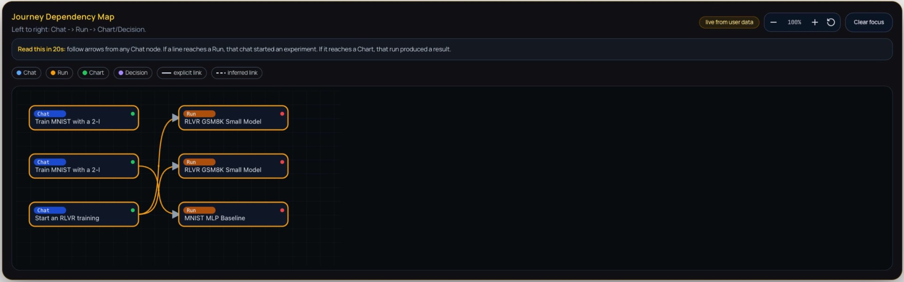
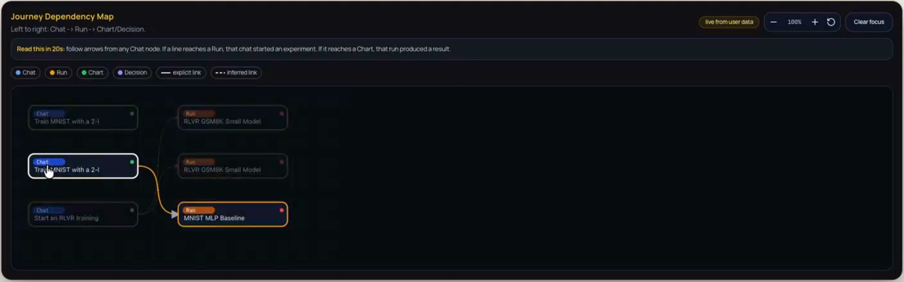
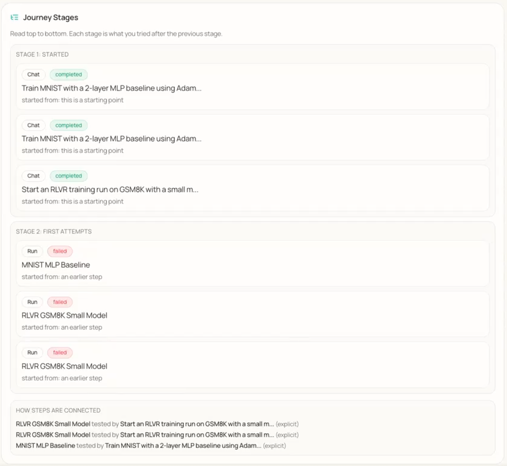
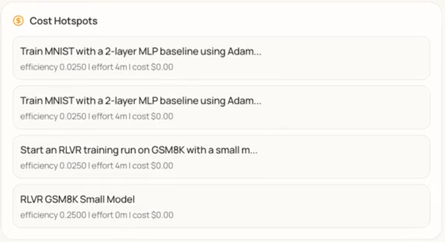
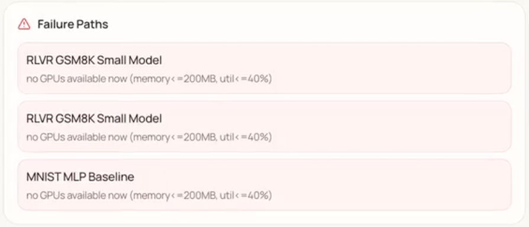
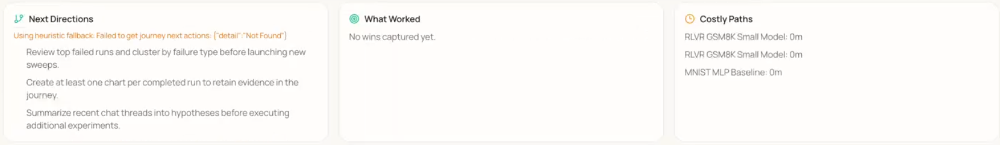
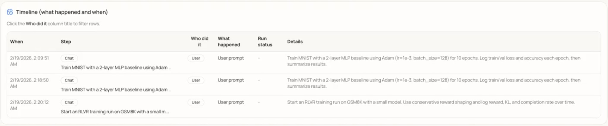
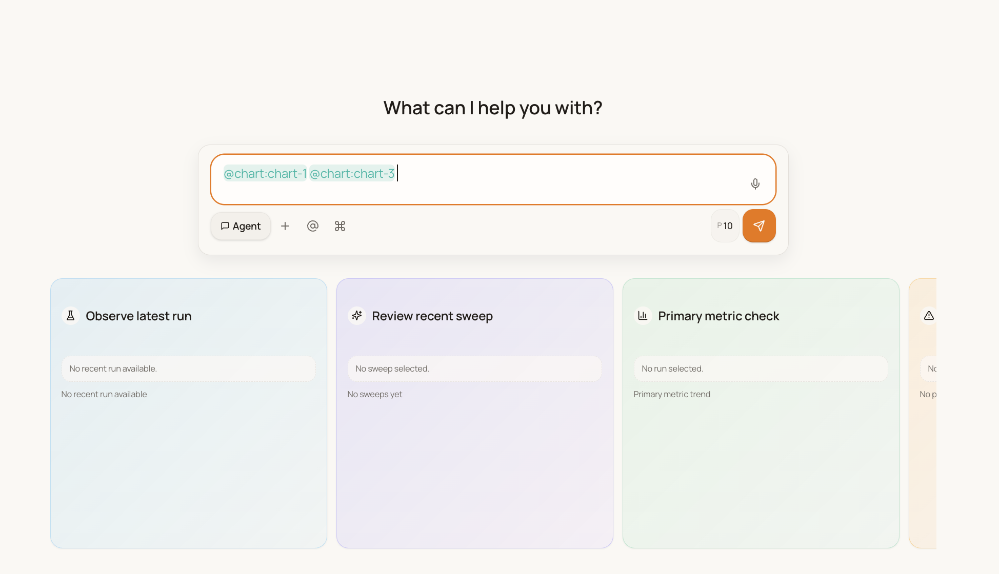

# Research Agent Mobile

**A mobile-first, AI-powered control center for machine learning experiments — monitor, debug, and steer your training runs from anywhere.**

*Hargen Zheng, Charlie Sun, Avi Mehta, Mihir Joshi*

*Mentored by Hao Zhang*

*UC San Diego, DSC 180B Capstone — 2025–2026*

## Project Links

- [Live Demo](#)
- [Technical Report](#)
- [Poster](#)
- [GitHub Repository](https://github.com/hao-ai-lab/research-agent)

---

## Abstract

Modern machine learning research increasingly relies on long-running, resource-intensive training pipelines that often span days or weeks. While computational capacity has scaled dramatically, tools for experiment oversight have remained largely desktop-bound and reactive. As a result, researchers frequently discover failures—such as hyperparameter divergence, stalled runs, or infrastructure crashes—long after they occur, leading to wasted compute and slowed research iteration. We present **Research Agent Mobile**, a mobile-first, agent-integrated system for real-time monitoring and intervention in machine learning experiments. The system combines a Next.js-based responsive frontend with a FastAPI backend that orchestrates training jobs via tmux, integrates with OpenCode for large language model (LLM) reasoning, and supports autonomous monitoring through a configurable “Wild Loop” control architecture. Unlike passive dashboards, the system enables semantic reasoning over logs, proactive anomaly detection, and remote intervention from mobile devices.

---

## One-screen elevator pitch

**Goal.** Research Agent Mobile gives researchers a **mobile control plane** for their ML experiments: monitor runs, get context-aware alerts, and take action (stop, restart, launch sweeps) from a phone—without being tied to a desk.

**Why it matters.** Long training runs and desktop-only tools (SSH, TensorBoard) create a blind spot: when you’re away, failures and divergences can go unnoticed for hours, wasting compute and slowing iteration. Closing the gap between “something went wrong” and “someone can act” reduces wasted credits and keeps the research loop moving, no matter where the researcher is.

**Target users:** ML researchers and lab teams who run long-running or multi-run experiments and need to supervise and intervene remotely.

---

## 1. Introduction

In the rapidly evolving domain of deep learning research, the efficiency of the scientific cycle
is increasingly limited not by the availability of raw compute, but by the researcher’s capac-
ity to maintain continuous oversight of experimental states. As machine learning models
grow in complexity and training pipelines extend over days or weeks, the cognitive burden
of monitoring multiple concurrent processes has become a primary bottleneck. The pre-
vailing workflow relies heavily on synchronous desktop-bound interaction–using tools such
as SSH terminals and large-screen dashboards such as TensorBoard–which fails to account
for the asynchronous reality of modern model training. This rigidity forces researchers to
structure their lives around their experiments, tethering them to workstations to ensure
runs do not fail unobserved.

This reliance on desktop-centric tooling creates a significant ”blind spot” in the research
workflow . Standard observability tools are poorly optimized for mobile devices, touch inter-
faces, or intermittent network connectivity . Consequently , when researchers are traveling,
in meetings, or simply away from their desks, they lose the ability to effectively supervise
their work. This physical constraint leads to tangible resource waste: critical failures–such
as hyperparameter divergence, metric collapse, or infrastructure crashes–often go unno-
ticed for hours until the researcher returns to their desk. The result is a cycle of delayed
insights and wasted computational credits, driven purely by the lack of a flexible supervision
interface.

To address these limitations, this project introduces Research Agent Mobile, a specialized
system that decouples experiment management from the desktop environment. The project
has a concrete objective: minimize the latency between an experimental deviation and
an actionable human response. Unlike passive monitoring dashboards that merely display
static charts, this system functions as an active, intelligent partner in the research process.
It establishes a ”mobile control plane” specifically optimized for small viewports, allowing
researchers to maintain high-level supervision and situational awareness regardless of their
physical location.

The core philosophy of Research Agent Mobile is to empower the researcher with actionable
intervention capabilities rather than passive visibility . The system allows users to monitor
the health of runs via prioritized, context-sensitive alerts and perform safe, immediate in-
terventions such as stopping a failing run, restarting a stalled job, or launching a new
hyperparameter sweep without ever returning to a workstation. By facilitating these inter-
actions through a mobile-first interface, the system bridges the gap between the demanding
requirements of deep learning training and the mobility of the modern researcher .

Ultimately, this work contributes to the emerging field of AI-assisted research workflows by demonstrating how autonomous agents can augment human oversight. By shifting the paradigm from constant manual monitoring to intelligent, remote management, Research Agent Mobile allows researchers to maintain high-velocity experimentation cycles without the cognitive load of constant desktop supervision.

### Scope

- **In scope (this project):** Single-user mobile control plane; WandB-backed charts; Research Journey (Dependency Map, Stages, Cost Hotspots, Failure Paths, Next Directions, What Worked, Costly Paths, Timeline); chat interface with agent; tmux-backed job orchestration; UX improvements described in §4.3.
- **Out of scope (this project):** Formal user studies; production auth or multi-tenancy; support for non-WandB loggers; stress-tested scalability for very large histories. See §5 (Limitations) for details.

---

## 2. System Overview

To realize the vision of a mobile-first research workflow , we engineered Research Agent
Mobile as a dual-component distributed system. The architecture is designed to bridge
the gap between ephemeral mobile interactions and persistent, long-running server pro-
cesses. High-level, the system integrates a high-performance Next.js frontend–specifically
optimized for the constraints of mobile viewports and touch latency–with a robust Python-
based orchestration backend.

This separation of concerns is critical. The backend manages job execution via persistent
tmux sessions, ensuring that computationally intensive training processes remain stable and
recoverable even if the client device loses connectivity or runs out of battery . Simultane-
ously , the frontend acts as a unified ”command center ,” decoupling the user from the raw
execution environment while providing a control plane for visualizing real-time metrics,
managing hyperparameter configurations, and inspecting generated artifacts.

Central to our methodology is the embedding of a context-aware Large Language Model
(LLM) agent directly into the experiment control loop. Unlike standard wrappers, this agent
is granted read-and-write access to the experiment’s execution context. This capability
enables it to interpret complex log streams, answer natural language queries regarding
training dynamics (e.g., ”Why is the loss diverging?”), and autonomously flag anomalies. By
synthesizing raw telemetry into semantic insights, the system transforms the mobile device
from a passive monitor into an active tool for high-level reasoning, allowing researchers to
collaborate with the system as they would with a peer .

---

## 3. Key Features

### 3.1 Mobile-First Interface

Standard web interfaces for experiment tracking often fail on mobile devices due to poor re-
sponsiveness and clutter . To address this, we implemented a responsive, dual-layout system
using Next.js 16. A primary engineering focus was the ”mobile-first” design philosophy , en-
suring the application adapts fluidly between minimum mobile viewports (down to 300px
width) and full desktop environments without loss of functionality . We developed a cus-
tom UI engine to resolve critical overflow issues common in standard CSS viewport queries.
This engine allows users to granularly adjust font scaling, button sizing, and layout density ,
ensuring usability is maintained regardless of the specific device hardware.

### 3.2 AI-Powered Chat Assistant

The chat interface – the central hub for human-agent collaboration – was re-architected to
support complex, non-linear workflows. We moved beyond simple request-response loops
to a state-managed message queue. This allows users to queue multiple commands, reorder
tasks, and utilize ”interruptible” states, giving the agent the ability to pause execution to
request human feedback before proceeding with destructive actions (such as terminating a
run).

On the backend, we refactored the data serialization format to accurately preserve the ”cog-
nitive chain” of the AI model. Rather than flattening the interaction history into simple text,
the system captures and renders the precise sequence of internal thought, tool execution, and
final text response. This granular fidelity is visualized in the frontend through distinct UI ele-
ments, distinguishing internal reasoning from external output. This transparency is vital for
building user trust in the agent’s decisions. Additional enhancements include session isola-
tion to prevent context bleeding between concurrent experiments, and a ”quote-and-reply”
feature that mirrors desktop-grade IDE interactions, enabling researchers to reference spe-
cific log lines or code blocks directly in the chat for targeted debugging.

### 3.3 Real-Time Visualization

Effective research requires immediate, interpretable visual feedback on training dynam-
ics. We integrated a flexible charting engine capable of interfacing with standard logging
frameworks like Weights & Biases (WandB). However , simply rendering external iframes
is insufficient for mobile contexts. Our system implements interactive, client-side charts
that allow users to toggle metric visibility , dynamically adjust axis scaling without page
re-renders, and manage chart density via a dedicated management popup.

We are currently extending this module to support ”Insight Charts”–custom visualizations
generated autonomously by the agent. By granting the agent direct access to raw metric
streams, it can identify patterns that a human might overlook. The agent can proactively
propose and generate comparative visualizations–such as radar charts for data mixture
analysis or video comparisons at specific training steps–without explicit user configura-
tion. This shifts visualization from a reactive task (plotting what you know to look for) to
a proactive one (surfacing anomalies through automated plotting and color-coded stability
indicators).

### 3.4 Research Journey

Scientific discovery is rarely a linear path; it is a branching tree of hypotheses, failures,
and refinements. Traditional version control systems track code changes but fail to cap-
ture the logic and decision-making process behind those changes. We introduce the ”Re-
search Journey”–a hierarchical, temporal visualization of the research lifecycle that effec-
tively functions as a ”semantic git” for experimental logic.

This feature allows researchers to visualize their project trajectory not as a flat list of com-
mits, but as a branching graph of decisions and outcomes. This structure enables deep ret-
rospective analysis: researchers can inspect the ”journey” to identify high-cost paths that
yielded low information gain, optimizing resource allocation for future iterations. Further-
more, by structuring history hierarchically , we empower the AI agent to perform ”meta-
analysis.” The agent can review the project’s entire branching history , reflecting on past
failures to recommend optimized directions for future experiments. This transforms the
history log from a passive record into an active knowledge base, significantly reducing the
cognitive load required to context-switch between long-running experiments.

### 3.5 Autonomous Monitoring (Wild Loop)

The core intelligence of the platform is driven by the ”Wild Loop,” an autonomous execution
environment that operates on the server independently of direct user interaction. This
backend architecture allows the agent to continuously monitor tmux sessions, parse real-
time logs, and execute interventions based on pre-defined heuristics or emergent anomalies
(e.g., ”stop training if loss spikes > 50%”).

To standardize the agent’s interaction with external tools and the file system, we adopted
the Model Context Protocol (MCP). MCP provides a universal interface for the agent to
connect with new libraries, custom scripts, or data sources without requiring core backend
refactoring. This modularity ensures the system is extensible; adding a new capability (e.g.,
querying a new dataset) is as simple as registering a new MCP tool.

The ”Wild Loop” is highly configurable, allowing users to define the boundaries of the
agent’s autonomy–ranging from passive monitoring to active hyperparameter tuning. By
integrating these loops with a prioritized event queue system, alerts generated during au-
tonomous operation are pushed instantly to the mobile client. This architecture ensures the
mobile device acts as a high-level command center , receiving synthesized intelligence and
strategic decision points rather than raw noise, thereby enabling effective ”human-in-the-
loop” supervision for otherwise autonomous research workflows.

---

## 4. Results

**Key results.** We achieved the following: (1) A working mobile-first control plane (monitor, alert, intervene) built with Next.js, FastAPI, and tmux. (2) A fully implemented and demonstrated Research Journey—Dependency Map, Stages, Cost Hotspots, Failure Paths, Next Directions, What Worked, Costly Paths, and Timeline—with video and figures below. (3) Chat and UX improvements (streaming, highlight-to-reply, session management, and related features) as described in §4.3. (4) The Research Journey provides an auditable, causal view of the research process that tools like TensorBoard do not. MCP integration and full Wild Loop evaluation remain in progress and are not reported as outcomes here.

The Research Journey page provides an auditable, high-level view of how research activities progress from conversation to execution and analysis. The following components support transparency, reproducibility, and retrospective analysis of the experimental process.

### 4.1 Research Journey

The following video demonstrates the Research Journey interface in use: the Dependency Map, Stages, Cost Hotspots, Failure Paths, and related components.

<video controls width="100%" style="max-width: 720px;">
  <source src="video/research-journey-demo.mov" type="video/quicktime">
  <source src="video/research-journey-demo.mp4" type="video/mp4">
  Your browser does not support the video tag. You can <a href="video/research-journey-demo.mov">download the video</a>.
</video>
*Research Journey demonstration (screen recording).*

**Journey Dependency Map.** The Dependency Map is a directed node-link diagram that encodes the causal and sequential relationships among research artefacts. Nodes are classified by type—Chat (conversational prompts), Run (executed experiments), Chart (visualisations), and Decision (critical junctures)—and laid out from left to right to reflect the flow: Chat → Run → Chart/Decision. Edges are distinguished as explicit (direct, solid) or inferred (contextual, dashed), clarifying which links are user-specified versus derived. The map makes the lineage from ideas to experiments and from experiments to analyses visible at a glance, supporting interpretability and auditability of the research trajectory. Interactive controls (zoom, reset view, clear focus) allow users to inspect specific subgraphs and reduce visual clutter.

*Figure 1: Journey Dependency Map — a directed graph of research artefacts (Chat, Run, Chart, Decision) with left-to-right flow from conversational prompts to experiment runs and analyses. Arrows indicate causal links between nodes.*

*Figure 2: Journey Dependency Map on hover — tooltip or detail view shown when hovering over a node or edge, revealing additional context (e.g., node label, status, or relation type) for inspection without leaving the map.*

**Journey Stages.** The Journey Stages component presents a chronological, stage-based account of the research process. Stages are ordered top-down so that each stage reflects a coherent set of actions or attempts, often in response to outcomes from the previous stage. Within each stage, individual steps are listed with their type (e.g., Chat, Run), completion status (completed or failed), and contextual origin. A dedicated “How steps are connected” section explicates causal links and dependencies between steps, enhancing traceability and reproducibility.

*Figure 3: Journey Stages — chronological stages of the research process with individual steps (e.g., Chat, Run), completion status (completed or failed), and a section describing how steps are connected.*

**Cost Hotspots.** This component identifies and summarises resource-intensive activities during experimentation. It displays training runs or experimental phases in cards with task descriptions and quantitative metrics: efficiency, effort (e.g., duration), and cost. The component documents the resource profile of key activities, enabling informed decisions about future resource allocation and methodological changes.

*Figure 4: Cost Hotspots — list of resource-intensive training runs or phases with task descriptions and metrics (efficiency, effort, cost) for each entry.*

**Failure Paths.** Failure Paths logs and surfaces instances where computational tasks failed due to resource unavailability. Each failure is shown in a distinct card with a description of the run and the reason for failure (e.g., no GPUs available). The component provides an auditable record of operational impediments and supports identification of systemic bottlenecks.

*Figure 5: Failure Paths — alert list of runs that failed due to resource unavailability (e.g., no GPUs available), with run name and failure reason per card.*

**Next Directions, What Worked, and Costly Paths.** Three related components support forward planning and learning from outcomes. *Next Directions* offers prescriptive guidance for subsequent steps (e.g., clustering failed runs by failure type, generating at least one chart per completed run). *What Worked* aggregates successful outcomes—validated methods and effective configurations—forming a knowledge base for replication. *Costly Paths* records experimental directions that consumed resources without yielding desired results, helping avoid re-exploring unproductive avenues.

*Figure 6: Next Directions (prescriptive guidance for subsequent steps), What Worked (record of successful outcomes), and Costly Paths (record of resource-intensive but unproductive directions).*

**Timeline.** The Timeline provides a chronological, tabular log of activities. Each row includes: *When* (timestamp), *Step* (e.g., Chat), *Who did it* (e.g., User), *What happened*, *Run status* (where applicable), and *Details*. The “Who did it” column is filterable. The Timeline offers a granular, auditable record of interactions and system states for transparency and retrospective analysis.

*Figure 7: Timeline — tabular log of Research Journey events with columns When, Step, Who did it, What happened, Run status, and Details; the "Who did it" column is filterable.*

**How to interpret the Research Journey.** Use the following as a guide to what is actionable versus what to treat as suggestive: (1) **Dependency Map** — Solid edges are user-specified links; dashed edges are inferred. Treat inferred links as hypotheses to verify when auditing. (2) **Cost Hotspots / Costly Paths** — Use for resource allocation and to avoid repeating expensive, low-value directions; they are not a substitute for domain judgment on scientific merit. (3) **Failure Paths** — Check here first when a run is stuck or missing; supports bottleneck analysis (e.g. recurring “no GPUs”). (4) **Next Directions / What Worked** — LLM-generated; use as suggestions, not ground truth, and validate against your own goals and constraints. (5) **Timeline** — Fine-grained audit trail; filter by “Who did it” to separate user vs system actions.

### 4.2 MCP Integration

**Agent & MCP integration.** The agent and MCP (Model Context Protocol) are integrated through a structured run-management layer and an autonomous agent loop. The following describes the protocol and the loop design.

**Model Context Protocol (MCP).** A FastMCP server exposes schema-validated run-management tools (*create_run* with configurable launch policies, *start_run*) so the agent invokes backend capabilities via structured tool calls instead of ad-hoc commands. Runs execute in tmux-backed windows with streamed log endpoints, providing full observability into every agent-initiated experiment. The diagram below summarizes the bidirectional interaction between the Agent and MCP.

**Wild Loop V2.** The autonomous execution layer is structured as an autonomous, multi-iteration agent loop with *plan–execute–reflect* stages. The planning pass explores the codebase and builds a task checklist. Execution iterations tackle one task each with a fresh agent context. A built-in struggle detector identifies stalled progress and overly short iterations. On completion, a reflection step evaluates outcomes, optionally continues the loop, and extracts reusable memories for future sessions. Every iteration auto-commits to Git and logs to a structured iteration journal. Users control autonomy level (*cautious* / *balanced* / *full*) and can steer or reorder pending agent actions through a drag-and-drop priority event queue.

### 4.3 User Experience

Beyond the core architecture, the team refined the user experience of the chat interface through targeted improvements. Early work focused on correctness and polish: a bug causing assistant responses to appear duplicated for short user inputs was patched, and code outputs were updated to render inside syntax-highlighted boxes. A three-dot context menu was added to each chat entry, exposing options to save, reference, or archive a session; saved chats appear in a dedicated section at the top of the sidebar.

A highlight-to-reply feature allows users to select any portion of the assistant’s response to trigger an inline reply button, inserting the quoted excerpt as a reference chip. Streaming output uses sticky auto-scrolling: the chat view follows new tokens when the user is near the bottom, pauses if they scroll up, and resumes when they scroll back down—preserved correctly when switching away from and returning to an actively streaming session.

Session management was improved with AI-generated chat titles (via OpenCode) and an inline rename feature. Contextually generated follow-up prompt suggestions appear as clickable pill buttons beneath the assistant’s most recent message. A session selector dropdown, runs dropdown for associating experiments with chat context, and a context length estimator give users visibility into session state and model context usage. A regression that caused chat text to stop rendering in agent mode following Wild Loop changes was identified and fixed.

*Figure 8: Chat input with visible blinking cursor and reference chips (@chart) — the cursor indicates focus for typing, and reference chips render as distinct pills without overlap.*

---

## 5. Discussion

**Interpretation.** The Research Journey components collectively address a gap left by conventional experiment trackers. Tools such as TensorBoard or WandB focus on metric time series and run metadata but do not explicitly model the *causal* relationship between user intent (e.g., a chat prompt), the resulting runs, and downstream artefacts (charts, decisions). The Journey Dependency Map makes this lineage visible as a directed graph, supporting both quick orientation and retrospective audit. The separation of explicit versus inferred links clarifies which connections are user-specified versus system-derived, which is important for trust and for debugging the agent’s reasoning. The Timeline, Stages, Cost Hotspots, and Failure Paths provide complementary views: a fine-grained event log, a stage-based narrative, a resource ledger, and a failure digest. Together with Next Directions, What Worked, and Costly Paths, the system does not only record history but also surfaces prescriptive guidance and learned outcomes—aligning with the claim that the platform functions as an “active, intelligent partner” rather than a passive dashboard.

**Limitations.** Several limitations should be noted. First, we have not yet reported formal user studies or quantitative measures of task completion time, error recovery, or user satisfaction; the value of the dependency map and reflection panels is supported by design rationale and component-level description rather than controlled evaluation. Second, the system depends on backend availability and, where Next Directions or other features use an LLM, on the quality and latency of that service; heuristic fallbacks mitigate but do not eliminate this dependency. Third, the scalability of the Journey graph and the Timeline has not been stress-tested for very long projects with hundreds of runs and thousands of events; large histories may require aggregation, filtering, or summarization to remain usable on mobile viewports. Finally, MCP integration and broader agentic control loops are still under development; discussion of agent autonomy and human-in-the-loop boundaries will be strengthened once those components are fully operational and evaluated.

**Implications.** The work contributes to the broader goal of decoupling experiment oversight from the desktop. By providing a hierarchical, semantic view of the research process, the Research Journey can reduce the cognitive load of context-switching between runs and help researchers avoid repeating costly or unproductive paths. The combination of real-time monitoring (via the Wild Loop and event queue) with retrospective analysis (via the Journey) supports a workflow in which the researcher intervenes when necessary but need not remain tethered to a workstation. For AI-assisted research workflows, the system illustrates how an LLM-backed agent can be given read-and-write access to the experiment context while still leaving critical decisions and interpretations to the human, with the Journey serving as a shared record of what was done and why.

**Future work.** Planned extensions include: (1) completing and evaluating the MCP integration and Wild Loop configurations so that the agent’s tool use and autonomy can be reported and tuned systematically; (2) conducting user studies to measure the impact of the Research Journey and mobile interface on time-to-detection of failures and on researchers’ perceived workload; (3) extending the Journey to support export or integration with external tools (e.g., for reproducibility packages or papers); and (4) exploring aggregation and summarization strategies for large journeys so that the interface remains effective as project history grows.

---

## 6. Conclusion

Machine learning research is increasingly constrained not by compute availability but by the researcher’s ability to maintain continuous oversight of long-running, distributed experiments. Desktop-bound tools and reactive dashboards leave a critical blind spot: when researchers are away from their workstations, failures and anomalies can go undetected for hours, wasting resources and slowing iteration. This report presented **Research Agent Mobile**, a mobile-first, agent-integrated system designed to close that gap by providing a remote control plane for monitoring and steering experiments in real time.

The system combines a responsive Next.js frontend with a FastAPI backend that orchestrates jobs via tmux, embeds an LLM agent with read-and-write access to the experiment context, and supports autonomous monitoring through the configurable Wild Loop and MCP-based tool integration. We described the design and implementation of the user interface—including mobile-first layout, state-managed chat with interruptible execution, and transparent rendering of the agent’s cognitive chain—and of the **Research Journey**, a hierarchical, temporal view that functions as a “semantic git” for experimental logic. The Journey’s components—the Dependency Map, Stages, Cost Hotspots, Failure Paths, Next Directions, What Worked, Costly Paths, and Timeline—together provide both an auditable record of the research process and prescriptive surfaces for reflection and planning.

By decoupling experiment oversight from the desktop and pairing it with an intelligent agent that can reason over logs, flag anomalies, and suggest next steps, Research Agent Mobile demonstrates a viable path toward high-velocity experimentation without the cognitive burden of constant manual supervision. We have outlined limitations and future work, including formal user studies and full evaluation of the agentic control loops. We hope this work contributes to the growing effort to make AI-assisted research workflows more flexible, transparent, and actionable for researchers operating under real-world constraints.

---

## Team

**Hargen Zheng**  
Integrated front-end and back-end systems to support more advanced user interactions. Key contributions: real-time auto-scrolling logic for streaming output, and a message-edit feature that lets users refine previous prompts seamlessly. Currently contributing to the MCP server.

**Charlie Sun**  
Shipped multiple chat and UX improvements: AI-generated chat titles (user summaries), smart follow-up questions from the assistant, and chat rename functionality. Currently focused on the Research Journey and agentic workflows.

**Avi Mehta**  
Improved the chat experience across several PRs: fixed and debugged chatbot text streaming, saved/favorite chats, clickable highlight-to-reply, blinking cursor in the textbox, and code outputs in syntax-highlighted boxes. Currently working on WandB chart integration and the MCP server.

**Mihir Joshi**  
Implemented multiple feature improvements and changes, most notably adding chat selectors, token usage estimation, and run selection dropdowns to improve navigation and context awareness. Also contributed to the WandB chart integration and the MCP server.

**Hao Zhang**  
Mentor and advisor.

---

## References

<!-- 
Link to relevant papers, tools, and resources:
- OpenCode / LLM tooling
- Model Context Protocol (MCP)
- Weights & Biases
- Next.js, FastAPI
- Any papers that informed your approach
-->

---

*UC San Diego — Data Science Capstone (DSC 180AB) — 2025–2026*
